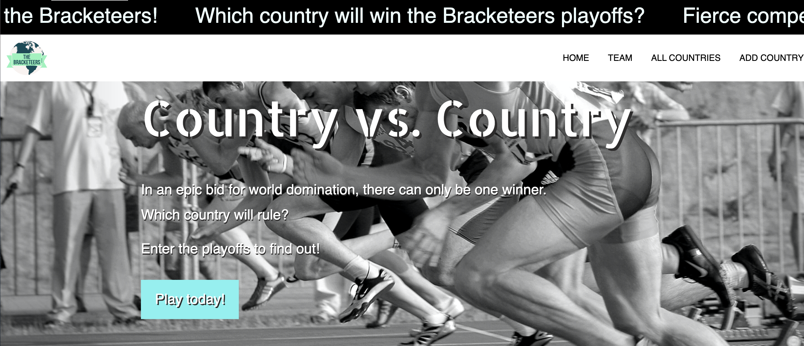

# projectpurple

## Index
* About our project
* How this works
* Design and animation
* Who we are 
* Technologies used
* Imgs
* Links

## About our project
This is the bracketeers app that engages the user to play and win an international sports bracket.

## How this works
step one:

The user logs in to the game. If the user does not have an account, they can go to the signup page. Once signed up, the user is taken to the login page where they can enter their email and password. 

Step two: 

Once their creditials are entered, the user is taken to the main page where they can find out more about the game and view the profiles of the creators of the app. 

Step three:

At the top of the main page, the user has an option to view ALL COUNTRIES or ADD COUNTRY. Depending on their choice they can start the game. 

Step four:

Playing the game: In ALL COUNTRIES the user clicks on PLAY GAME and the countries they have chosen appear on the bracket round one. The user plays three rounds and the FINAL round determines which country wins the championship.

## Design and Animation
We chose a very neautral palate with pops of color. The animations we input were the typewriter scroll on the login and sign up pages. There is a ticker tape banner on the main page, which runs script telling the user what the game is all about. We added this to build excitement for the game. On the page where the game is played, the FINAL button, when pressed plays an APPLAUSE audio. 

## Who we are
Prabin Singh, Teresa Heidt, Abu Zeynu, Vanh Tharavong and Marcus Ramirez.

## Technologies used
Sequelize, Node, Bootstrap, W3 Schools framework, Handlebars, JawsDB.

## Imgs
Welcome to the login page! The USER enters in their email and password and they see a scroll at the top, 'Let the games begin..', as a forerunner of what is to come. 

The main page, or homescreen, is where the USER can view ALL COUNTRIES - where the game is played, ADD COUNTRY - where the user chooses their countries they want to play, and the use can view the TEAM.

The BRACKETS page - where the game is played. There are three rounds and the user can ADD their countries and then click PLAY GAME to start. The FINAL button is the CHAMPIONSHIP round and when the button is clicked, APPLAUSE is heard.

## Links

[Link to Heroku](https://bracketeers.herokuapp.com/)

[link to Github](https://github.com/prabin544/Bracketeers.git)

[Link to Video](https://drive.google.com/file/d/1eYNhK6yNaAtqW_1e2WDOnlj0APxbxPPy/view)
